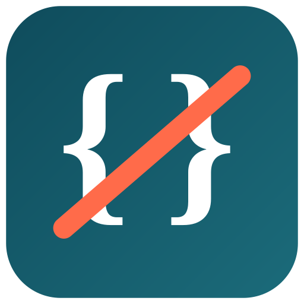

# FG Strip Comments plugin for Joomla

[](https://www.joomla.org)
[](https://www.php.net)
[](https://github.com/ferino75/plg_system_fgstripcomments/releases)
[](https://www.gnu.org/licenses/old-licenses/gpl-2.0.html)


A Joomla 6 system plugin that removes internal marker tags
(e.g. `{-- My City --}`) from the rendered front-end output — from module
titles, article titles, menu items, and so on — while keeping them fully
visible in the administrator back-end.

Part of the **FG** series of Joomla extensions. A modern replacement for
the long-unavailable **BIGSHOT Strip Comments** plugin (for Joomla
1.5 – 3.x), rewritten for Joomla 6's plugin API and namespacing.

## Example

In the administrator you name a module like this:

```
Opening Hours {-- My City --}
```

On the front-end, only this is shown:

```
Opening Hours
```

The `{-- My City --}` note is for your own back-end reference only (e.g.
to tell apart several similarly named modules/articles) and is never
shown on the public site.

## Installation

1. Download the latest release (`.zip`) from the [Releases](../../releases) tab.
2. In the Joomla administrator go to **System → Install → Extensions**
   and upload the downloaded `.zip`.
3. **System → Manage → Plugins** → find "System - FG Strip Comments" and
   publish it.

## Plugin settings

| Parameter | Description | Default |
|---|---|---|
| **Scope** | `Titles only` – strips markers only inside `h1`–`h6`, `<title>`, and link text (`<a>`, menu items). `Whole page` – strips markers everywhere in the output, except inside `<script>`/`<style>` blocks, which are never touched. | `Titles only` |
| **Opening delimiter** | Opening marker string. | `{--` |
| **Closing delimiter** | Closing marker string. | `--}` |
| **Also run in administrator** | If enabled, markers are also stripped in the back-end. | off |

## Requirements

- Joomla 6 (5+)
- PHP 8.1+

## License

GNU General Public License v2.0 or later — see [LICENSE](LICENSE).

## Changelog

See [CHANGELOG.md](CHANGELOG.md).
